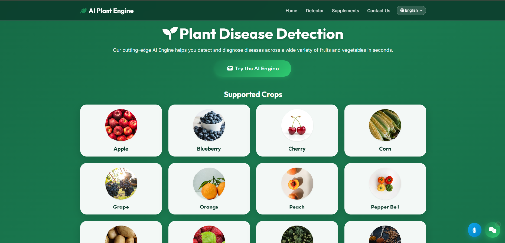
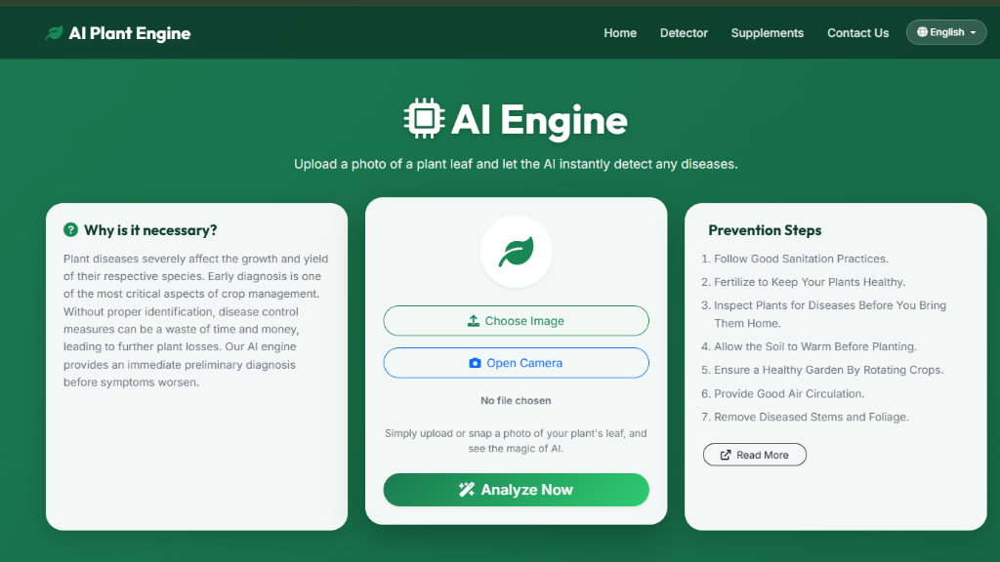
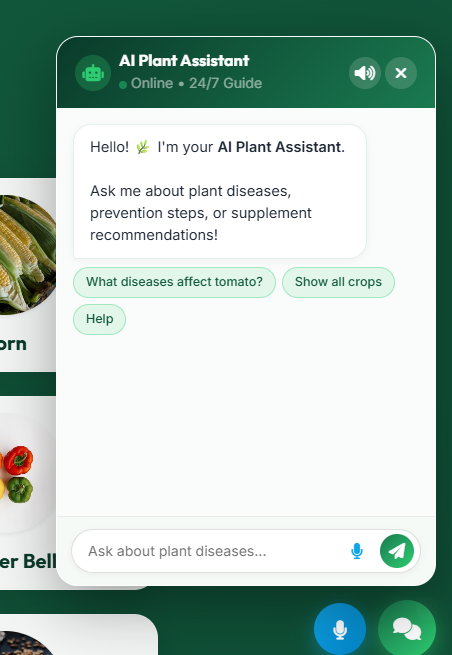
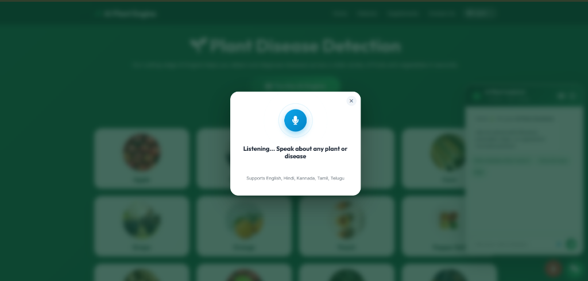
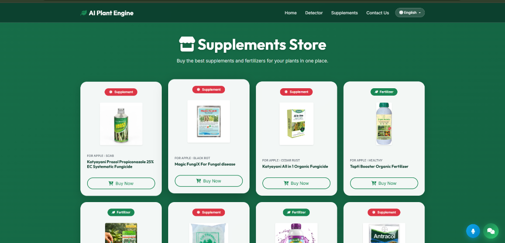

# 🌿 AI Plant Engine — Plant Disease Detection & Smart Agriculture Platform

[](https://python.org)
[](https://pytorch.org)
[](https://flask.palletsprojects.com/)
[](https://developer.mozilla.org/en-US/docs/Web/API/Web_Speech_API)
[](https://github.com/nagarajkaids0410-cloud/AI_Pest_Prediction)
[](LICENSE)

An intelligent, full-stack agricultural AI platform designed to help farmers, gardeners, and agronomists diagnose crop diseases instantly, consult an AI plant pathology assistant, receive voice-enabled guidance in regional Indian languages, and purchase recommended fertilizers and treatments.

---

## ✨ Key Features

- **🔬 Deep Learning Leaf Diagnosis**: Powered by a custom Convolutional Neural Network (CNN) built in PyTorch, classifying leaves into **39 distinct disease & healthy categories** across 14 major crops.
- **📸 Dual Input (Upload & Live Camera)**: Upload any leaf photo or snap a picture in real time using your device's camera with interactive live video feed and instant snapshot capture.
- **🤖 24/7 AI Plant Assistant**: An interactive floating chat assistant that answers queries regarding crop symptoms, biological prevention steps, and chemical/organic supplements with quick-action suggestion chips.
- **🌍 5-Language Multilingual Support**: Seamless one-click translation across **English, हिन्दी (Hindi), ಕನ್ನಡ (Kannada), தமிழ் (Tamil), and తెలుగు (Telugu)** without page reloading, persisting choices in `localStorage`.
- **🎙️ Speech-to-Text & Voice Assistant**: Full voice query support powered by the Web Speech API with animated ripple waveforms and real-time audio playback (TTS) in the user's selected language.
- **🛒 Supplements & Fertilizer Marketplace**: Comprehensive catalogue of 38+ organic fertilizers and fungicides with 100% locally hosted high-resolution packaging images and direct buy links.
- **💎 Modern Glassmorphic UI**: Premium responsive interface featuring animated emerald gradient backgrounds, translucent glass cards, smooth transitions, and mobile-first layouts.

---

## 📸 App Showcase

### 1. Home Page & Supported Crops
Modern landing page highlighting 14 supported crops with clean circular galleries and fast navigation.
<p align="center">
  
</p>

### 2. AI Engine Detector (File Upload & Live Camera)
Choose an image from storage or capture a live leaf snapshot using the integrated camera interface.
<p align="center">
  
</p>

### 3. AI Plant Chat Assistant
Context-aware floating assistant trained on extensive disease prevention steps and supplement data.
<p align="center">
  
</p>

### 4. Interactive Multilingual Voice Assistant
Speak naturally in English, Hindi, Kannada, Tamil, or Telugu to diagnose diseases and ask questions hands-free.
<p align="center">
  
</p>

### 5. Supplements & Fertilizer Marketplace
Curated remedies, organic tonics, and systemic fungicides with verified high-res product photos.
<p align="center">
  
</p>

---

## 🌾 Supported Crops & Diseases (39 Classes)

| Crop | Detectable Conditions |
| :--- | :--- |
| **🍎 Apple** | Apple Scab, Black Rot, Cedar Apple Rust, Healthy |
| **🫐 Blueberry** | Healthy |
| **🍒 Cherry** | Powdery Mildew, Healthy |
| **🌽 Corn (Maize)** | Cercospora Leaf Spot / Gray Leaf Spot, Common Rust, Northern Leaf Blight, Healthy |
| **🍇 Grape** | Black Rot, Esca (Black Measles), Leaf Blight (Isariopsis Leaf Spot), Healthy |
| **🍊 Orange** | Haunglongbing (Citrus Greening) |
| **🍑 Peach** | Bacterial Spot, Healthy |
| **🫑 Pepper Bell** | Bacterial Spot, Healthy |
| **🥔 Potato** | Early Blight, Late Blight, Healthy |
| **🍓 Raspberry** | Healthy |
| **🌱 Soybean** | Healthy |
| **🎃 Squash** | Powdery Mildew |
| **🍓 Strawberry** | Leaf Scorch, Healthy |
| **🍅 Tomato** | Bacterial Spot, Early Blight, Late Blight, Leaf Mold, Septoria Leaf Spot, Spider Mites (Two-Spotted Spider Mite), Target Spot, Tomato Yellow Leaf Curl Virus, Tomato Mosaic Virus, Healthy |

---

## 🚀 Getting Started

### Prerequisites
- Python 3.8+ installed on your system.
- Modern web browser (Google Chrome, Microsoft Edge, Safari, or Firefox).

### 1. Clone the Repository
```bash
git clone https://github.com/nagarajkaids0410-cloud/AI_Pest_Prediction.git
cd AI_Pest_Prediction
```

### 2. Set Up Virtual Environment (Recommended)
```bash
# Windows
python -m venv venv
venv\Scripts\activate

# Linux / macOS
python3 -m venv venv
source venv/bin/activate
```

### 3. Install Dependencies
```bash
cd "Flask Deployed App"
pip install -r requirements.txt
```

### 4. Run the Application
```bash
python app.py
```
Open your browser and navigate to **`http://127.0.0.1:5000`**.

---

## 📁 Project Structure

```plaintext
AI_Pest_Prediction/
├── Flask Deployed App/
│   ├── app.py                      # Flask backend & /api/chat endpoint
│   ├── CNN.py                      # PyTorch CNN model architecture
│   ├── plant_disease_model_1_latest.pt # Pretrained PyTorch weights (39 classes)
│   ├── disease_info.csv            # Descriptions & prevention database
│   ├── supplement_info.csv         # Medicines, fertilizers & buy links
│   ├── static/
│   │   ├── images/
│   │   │   ├── crops/              # HD crop gallery photos
│   │   │   └── supplements/        # High-res local product packaging images
│   │   ├── js/
│   │   │   ├── chatbot.js          # Chatbot logic, chips & UI routing
│   │   │   ├── i18n.js             # 5-language translation dictionary & engine
│   │   │   └── voice.js            # Web Speech API recognition & TTS playback
│   │   └── uploads/                # Temporary leaf upload directory
│   └── templates/
│       ├── base.html               # Master layout, navbar, language selector & modals
│       ├── home.html               # Landing page with crop catalogue
│       ├── index.html              # Detector with upload & live camera
│       ├── submit.html             # Detailed diagnostic results & remedy card
│       ├── market.html             # Supplements store with 38 verified products
│       └── contact-us.html         # Developer contact & socials
├── Model/                          # Jupyter training notebooks & evaluation metrics
├── demo_images/                    # High-resolution screenshots for documentation
├── test_images/                    # Sample leaf photos for testing
└── README.md                       # Documentation
```

---

## 👨‍💻 Author & Developer

**Nagaraj K**
- 💼 **LinkedIn**: [Nagaraj K](https://www.linkedin.com/in/nagaraj-k-52168a3bb/)
- 🐙 **GitHub**: [@nagarajkaids0410-cloud](https://github.com/nagarajkaids0410-cloud)
- ✉️ **Email**: [nagarajkaids0410@gmail.com](mailto:nagarajkaids0410@gmail.com)

---

## 🤝 Contributing
Contributions are always welcome! Feel free to fork the repository, open issues, or submit pull requests for new crops, model optimizations, or language additions.
